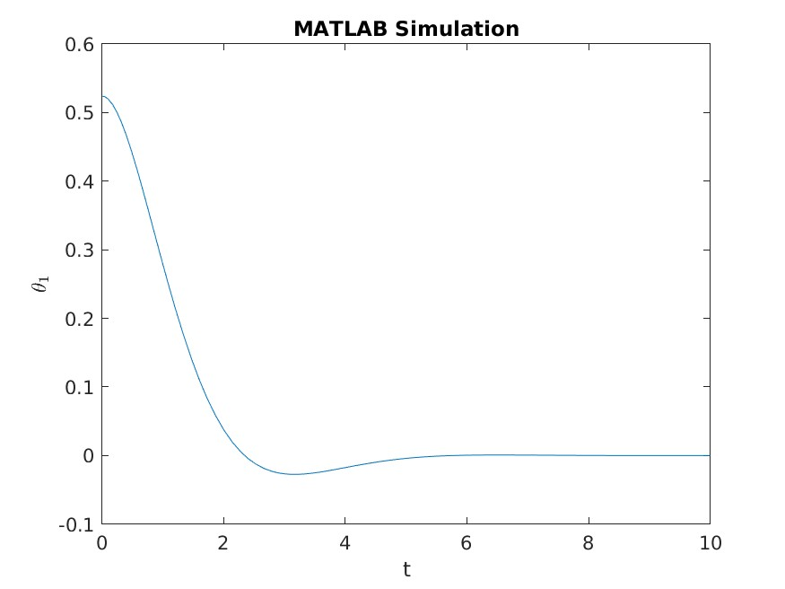
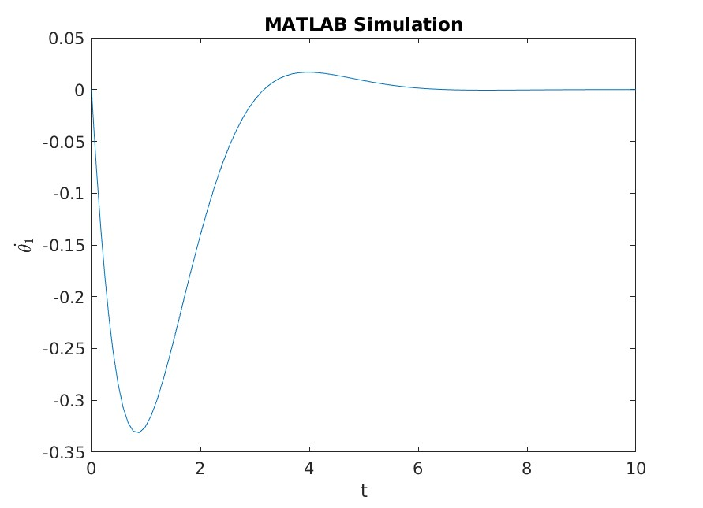
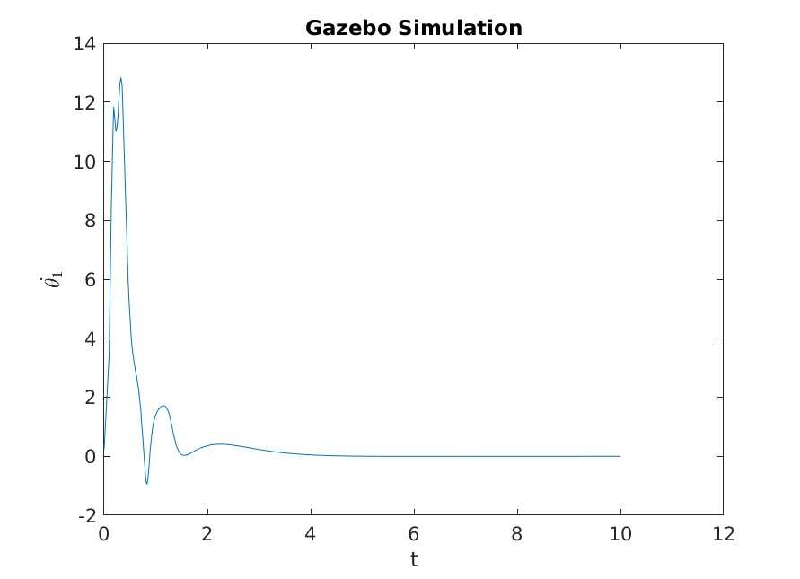
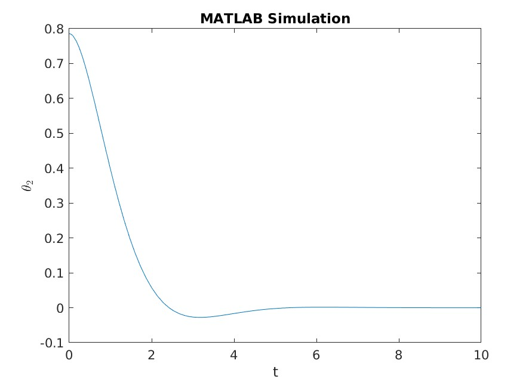
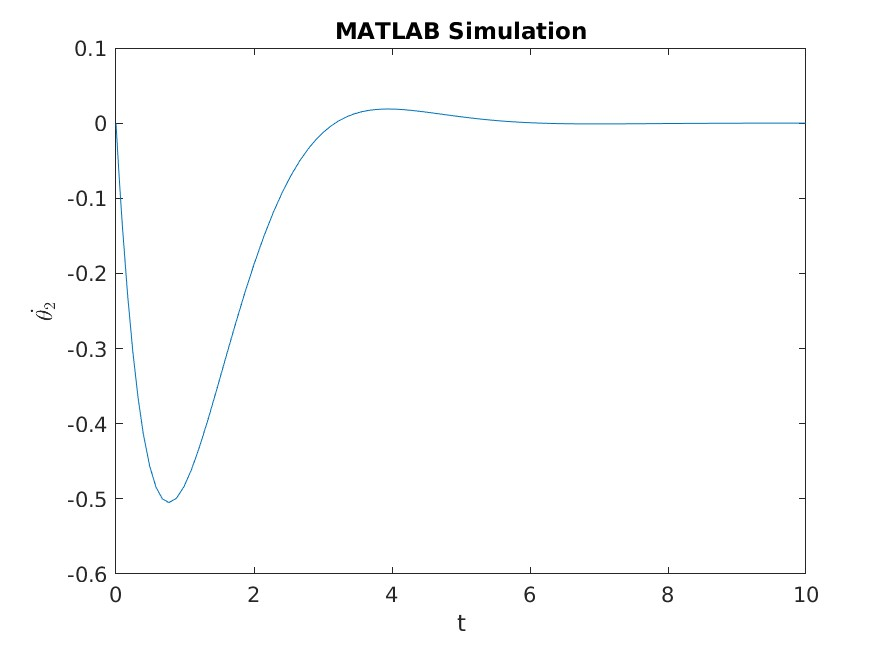

**Position Tracking using State Feedback Controller Design for a 2 DoF RRBot**

<!-- TOC -->

- [About](#about)
    - [MATLAB](#matlab)
    - [Gazebo and ROS](#gazebo-and-ros)
- [Observations and Results](#observations-and-results)
- [Designer Details](#designer-details)
- [License](#license)

<!-- /TOC -->

# About

The assignment aims to derive the equations of motion for a 2-DoF Revolute Revolute Arm.

I worked on deriving the equation of motion by taking the derivatives of the Lagrangian Function. This method is called as Euler-Lagrange Method.

The Lagrange Equation uses the terms Kinetic and Potential Energy of the system. Where,f

$$
LE = KE - PE
$$

The Euler-Lagrangian Equations can be derived by taking a derivative of the Lagrangian Equations. Where,

$$
\begin{equation}
\frac{d}{dt}\frac{\partial L}{\partial \dot{q_{i}}} - \frac{\partial L}{\partial{q_{i}}}= u_{i}\notag
\end{equation}
$$

This would result in an equation of form $a\ddot{q} + b\dot{q} + c{q} + d = 0$. We solve for $\ddot{q_{i}}$ which results in the equation of motion for the system. This system does not contain any form of input. Thus, $u_{i} = 0$ for all joints.

## MATLAB
The complete calculation has been done [here (webpage form)](https://htmlpreview.github.io/?https://github.com/parth-20-07/2-DoF-Revolute-Revolute-robot-arm-Equation-of-Motion/blob/21aea4f0ee493422593e973d1964ae5801dc50d7/Solution/MATLAB/main.html) in MATLAB. The systems with the equation of motion are simulated as follows

## Gazebo and ROS

The same system is simulated with the equations of motion present in Gazebo with real-world physics replication as shown [here (webpage form)](https://htmlpreview.github.io/?https://github.com/parth-20-07/2-DoF-Revolute-Revolute-robot-arm-Equation-of-Motion/blob/main/Solution/Gazebo/rrbot_passive.html). It generates in system behaving as follows

# Observations and Results

| Graph Type                | MATLAB                                                    | Gazebo                                                    |
| ------------------------- | --------------------------------------------------------- | --------------------------------------------------------- |
| $\theta_{1}$ vs $t$       |        |        |
| $\dot{\theta_{1}}$ vs $t$ |  |  |
| $\theta_{2}$ vs $t$       |        |        |
| $\dot{\theta_{2}}$ vs $t$ |  |  |

**Possible Reasons for difference:**
- The lack of friction in the MATLAB System.
- The estimated value of gravitational acceleration in MATLAB.

# Designer Details

- Designed for:
  - Worcester Polytechnic Institute
  - RBE502 - Robot Control
- Designed by:
  - [Parth Patel](mailto:parth.pmech@gmail.com)

# License

This project is licensed under [GNU General Public License v3.0](https://www.gnu.org/licenses/gpl-3.0.en.html) (see [LICENSE.md](LICENSE.md)).

Copyright 2023 Parth Patel

Licensed under the GNU General Public License, Version 3.0 (the "License"); you may not use this file except in compliance with the License.

You may obtain a copy of the License at

_https://www.gnu.org/licenses/gpl-3.0.en.html_

Unless required by applicable law or agreed to in writing, software distributed under the License is distributed on an "AS IS" BASIS, WITHOUT WARRANTIES OR CONDITIONS OF ANY KIND, either express or implied. See the License for the specific language governing permissions and limitations under the License.
